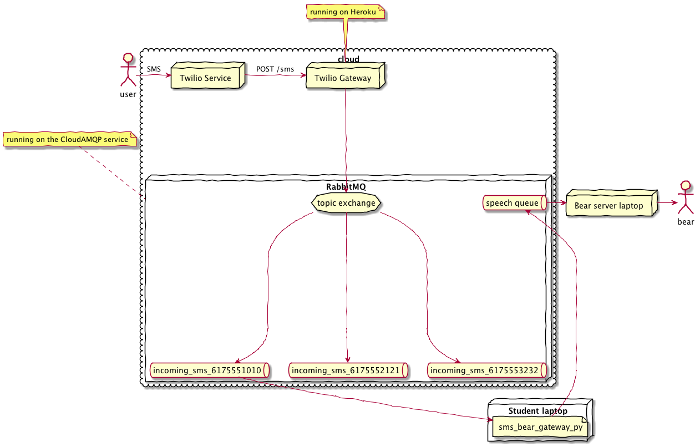

# Bear Trivia
## Created by Isa Blancett and Matt Brucker

Bear Trivia is a revolutionary new way to play trivia! Start a game of trivia with the bear, and he will ask you questions - send your answers via text, and earn points! Bear Trivia™ - it's fast, it's fun, and it's free.


## Quick Start (client only)

This requires a running Bear server, and a [Twilio ⟶ MQTT Gateway](https://github.com/olin-build/twilio-mqtt-gateway).

You should also have a Twilio phone number, and the credentials for
The Bear server and Twilio gateway.

1. Follow the Install instructions below.
2. Run `python3 examples/sms_bear_gateway.py`
3. Send a text message to your Twilio phone number.


## Local Install

Make sure you have a running Python 3.6. Earlier versions of Python 3.x might
work too, but haven't been tested. Python 2.x is Right Out.

### Postgres Setup

Running Bear Trivia requires a running PostgreSQL server. Bear Trivia is designed to work with PostgreSQL 9.6, but earlier versions may work as well. Follow the instructions [here](https://wiki.postgresql.org/wiki/Detailed_installation_guides) to install PostgreSQL. Next, create the database:

`createdb trivia`

Now, create a user and grant privileges on the database:

```
$ sudo -u postgres psql
CREATE USER bearclient WITH PASSWORD 'my_password';
GRANT ALL PRIVILEGES ON DATABASE "trivia" to my_username;
```

Choose a password for `my_password`, and copy that value as `POSTGRES_KEY` in `envrc.template`.

### macOS and Linux

Copy `envrc.template` to `.envrc`. On Linux/macOS: `cp envrc.template .envrc`.

Replace the strings in `.envrc` by your Twilio and MQTT credentials and phone number.

Execute: `source .envrc`

Or, optionally install [direnv](https://direnv.net/). This will prevent you from having to manually `source .envrc` each time in the future.

Now continue to the "All Platforms" instructions.

### Windows

On Windows, set an environment variable from the command line using:

`setx MQTT_URL mqtt://…`

Repeat for each variable in `envrc.template`.

This adds entries to the Windows registry. You only need to do this once.

### All Platforms

To install dependencies:

`pipenv install`

Start the Bear Trivia controller.

`pipenv run python bear_controller.py`

## Run the Server

Provision a RabbitMQ server. Or, use the same server as the Twilio ⟶ MQTT
Gateway.

`pip3 install -r requirements.txt` and create `.envrc`, as above.

On Linux and Windows, install [espeak](http://espeak.sourceforge.net).
On macOS, the server uses the built-in `say` command, which has better quality.

`python tts_worker.py`.

## Remote (Heroku) Install

To deploy this app remotely, you'll need a Heroku account; get one [here](https://signup.heroku.com/). Next, install the [Heroku CLI](https://devcenter.heroku.com/articles/heroku-cli#download-and-install) (Linux only). Run `heroku login` with the credentials you created, and run `heroku apps:create app-name`, where `app-name` is a unique name for your app.

### Remote Setup

In your app directory, run the following:

```
$ heroku git:remote -a app-name
$ git push heroku master
```

### Environment Variable Setup

In order to run the app remotely, you need to setup the environment variables in Heroku. You can do this by running `heroku config:set VAR_NAME=value` for every environment variable in `envrc.template`, *except* `DB_PASSWORD` (we will get a different database password once we set that up). Alternatively, you can input them in your app's Settings tab on the Heroku Dashboard.

### Heroku PosgreSQL Setup

To setup a basic PostgreSQL database in Heroku, run `heroku addons:create heroku-postgresql:hobby-dev`. That's all you need to do for setup: Heroku automatically creates a new environment variable `DATABASE_URL` when you create the PostgreSQL database, which contains the server, port, username, and password.

### Deployment

Once everything has been set up, run `git push heroku master` to push the app to Heroku.

## Test

`pytest` runs the unit tests (currently just of the `mqtt_json` package).

`pytest-watch` runs the tests in watch mode.

`tox` runs the tests in their own virtual environment.
This validates `requirements.txt` (and could be used to test the code in
multiple different Python versions).

## Architecture

The SMS ⟶ Bear gateway example depends on the [Twilio ⟶ MQTT Gateway](https://github.com/olin-build/twilio-mqtt-gateway).

Together with the Gateway, it looks like this:



## Acknowledgements

Based on Oliver Steele's [bear-as-a-service](https://github.com/olinlibrary/bear-as-a-service) project. All MQTT gateway and Twilio command code is based on the original bear-as-a-service project. Local install instructions, architecture diagram, and tests were also adapted from the original project's install instructions. The Heroku deployment instructions are also adapted from the [Olin Web Deployment Toolbox](https://toolboxes.olin.build/heroku/).

Bear-as-a-Service was adapted from Patrick Huston's Holiday Bear, introduced at
the Olin College December 2017 Holiday Party.

Jeff Goldenson came up with the “Bear as a Service” idea.

## LICENSE

MIT
